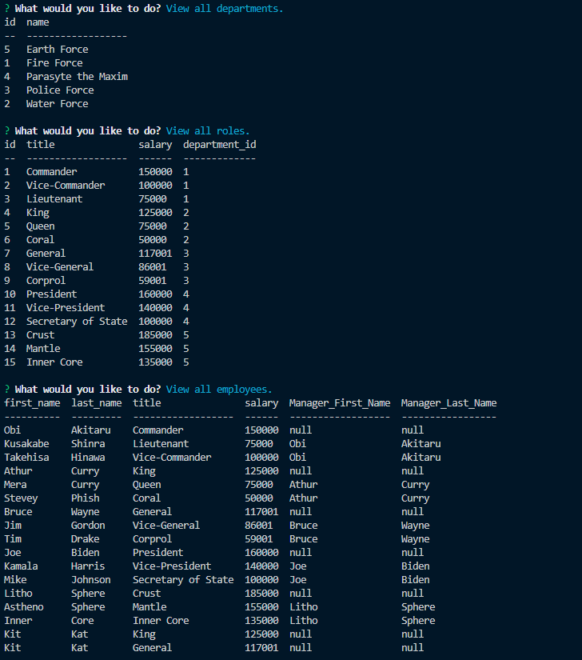
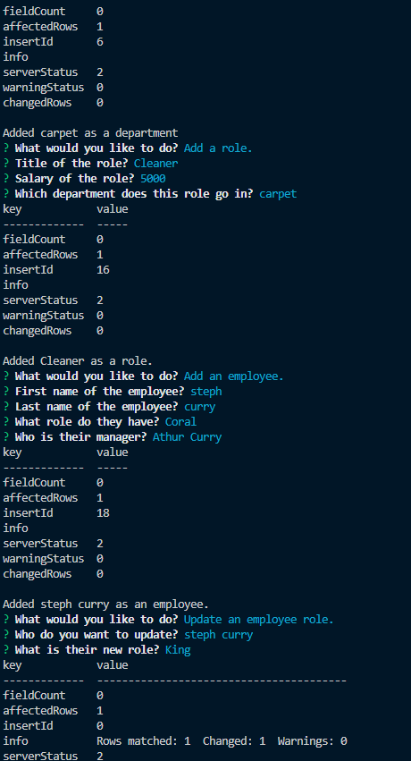

# Employee-payroll

## Description
This application allows for users to keep track, add, and or update any and all kinds of imformation through my first usage of sql. In the midst of this project I have decently got a grasp over sql and how to scaffold out my code functionality before implementing it into my main set of code. I did have some road blockers with a few of my own naming conventions as well as a couple of misread/misinterpretations from either documentations or instructions.
## Usage

## Video Demo
[Google Drive Link](https://drive.google.com/file/d/1XaZ6Sj7cCUyV6thLruOHHAwIeYiWS6UE/view?usp=sharing)